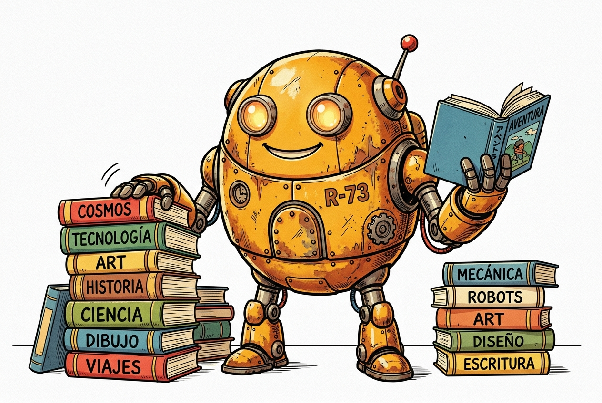

# 🤖 El Senyor Robot

<h3>Laboratori de Veu en Català</h3>

Converteix text en català a veu de robot de forma instantània.

<a href="https://jllobe12.github.io/SENYOR_ROBOT_VEU/" target="_blank" style="background-color: #FF6F3B; color: white; padding: 12px 24px; border-radius: 12px; font-weight: bold; text-decoration: none; display: inline-block; margin: 15px 0; border: 2px solid #18181b; box-shadow: 4px 4px 0px 0px #18181b;">
  🌐 VISITAR LA WEB
</a>

---

### ⚙️ Com funciona?
- **Text:** Escriu un text o tria una de les frases predefinides.
- **Ajust:** Controla la seriositat per fer-lo més o menys expressiu o robòtic.
- **Veu:** Sintetitza la veu per escoltar-la i descarregar-la a l'instant.

---

### 🌐 Recursos i enllaços d'interès

  
  <a href="https://sites.google.com/xtec.cat/recursostecno" target="_blank" style="font-weight: bold; color: #FF6F3B; text-decoration: none; font-size: 15px;">
    Visita Recursos Tecno
  </a>

